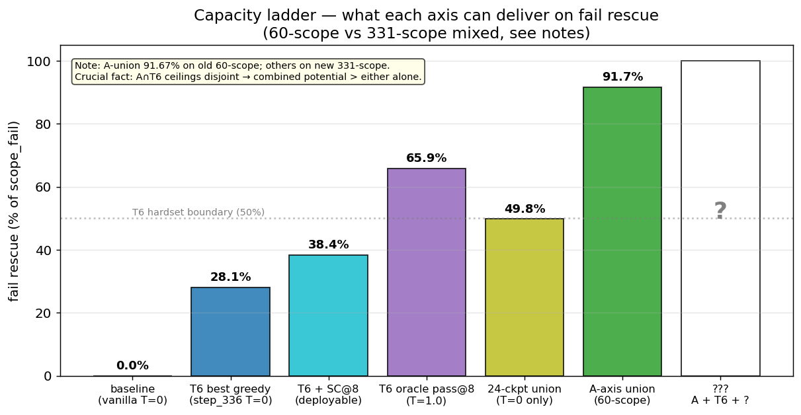
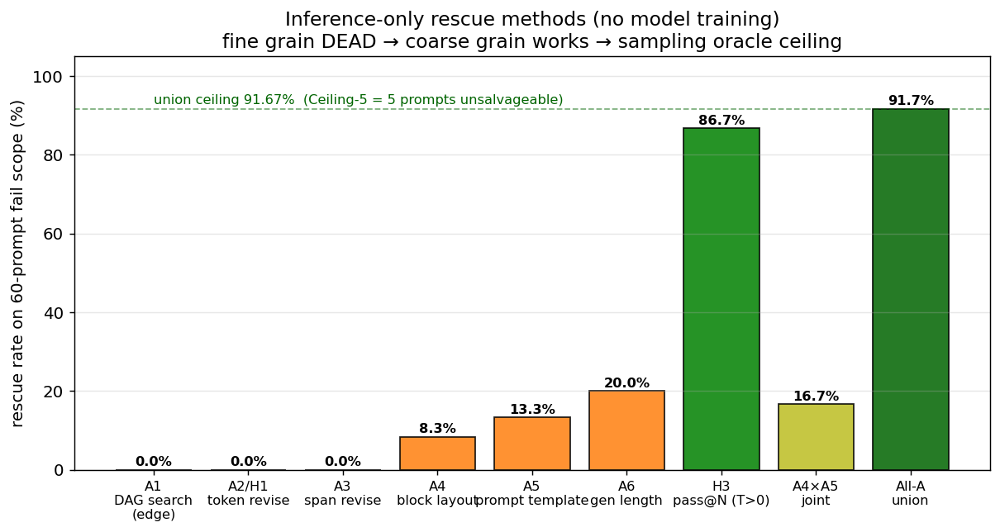
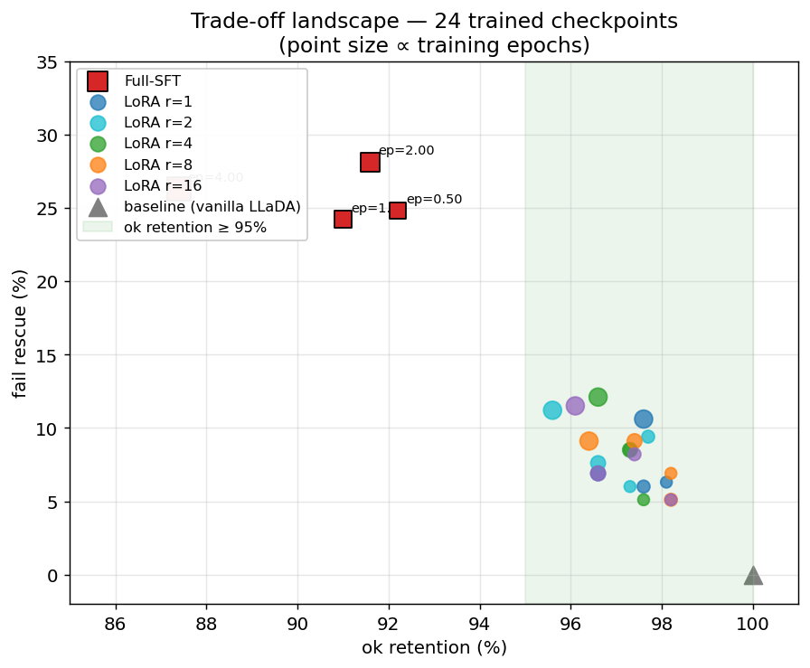
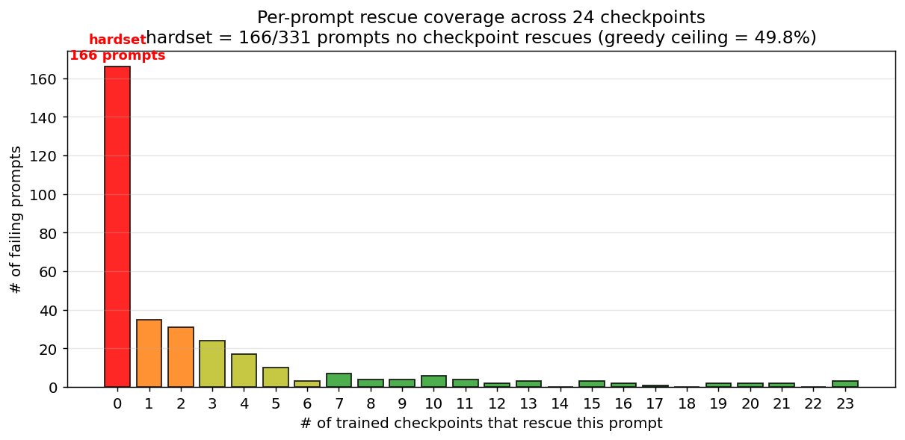
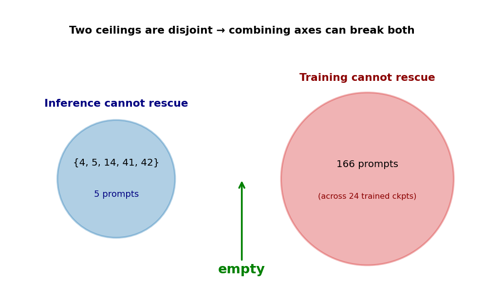
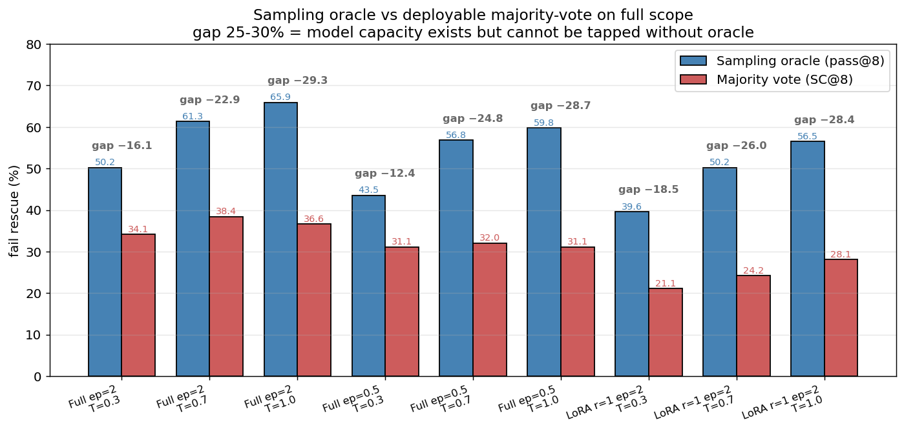

# Logic chain: A-axis → T6 → P2 Decode Frontier

> Language: English | 中文: [logic_chain_a_axis_to_p2.zh.md](logic_chain_a_axis_to_p2.zh.md)

**Purpose**: a single document tying together the project's full reasoning chain — from the A-axis fail-rescue experiments through the current P2 decode_ablate stage — so subsequent decisions (T7 / Verifier / RL) have a clean anchor.

**Last updated**: 2026-04-27 (T7 v2 running; result section left blank)

**Companion docs** (each stage has its own deep-dive archive; this file only stitches them together):
- `definitions_hard_sets.md` — authoritative term definitions
- `finding_a_axis_exploration.md` — A-axis details
- `finding_t6_training_ceiling.md` — T6 24-ckpt ablation
- `finding_p2_decode_frontier.md` — P2 decode_ablate + SC
- `runs/validation/t6_*ablate*/summary.md` — raw tables

---

## 0. Task definition

**Scope**: gsm8k test split (1319 problems).
**Baseline**: LLaDA-8B-Instruct under the canonical config (T=0 greedy, gen_length=128, block_length=32, low_confidence remasking, steps=128).
**`scope_fail`**: prompts the baseline gets wrong — 60 in v1.5; redefined to 331 in v1.6.1 (canonical re-run).
**`scope_ok`**: prompts the baseline gets right — 988.
**Rescue rate**: trained / decoding-modified model's pass@1 on `scope_fail`.
**Retention rate**: fraction of `scope_ok` still answered correctly.
**Core trade-off**: `max(rescue) s.t. retention ≥ high bar`.

---



> **Figure 0**: where each ceiling currently sits. greedy 28% → SC 38% → oracle pass@N 66% → inference-tweak union 91% → combined potential ?. Note: 60-scope vs 331-scope are different denominators; read the trend, not exact comparison.

---

## 1. Stage 1: A-axis — don't touch the model, only the inference

**Question**: base LLaDA scores 0% on the fail set; how much can pure inference-time tweaks rescue?

**Method**: sweep many inference-time interventions on the original 60-prompt scope.

| Method | Granularity | Result |
|---|---|---|
| A1 DAG search (greedy / NAS / E2E) | single DAG edge | **0/1319+200+106 across three independent runs** — DEAD |
| A2 / H1 single-token revise | single token | 0/137 REJECTED |
| A3 span revise (window) | 4-token window | 0/60 REJECTED |
| **A4 block-layout rerank** | whole block (8–64 token) | **5/60 = 8.33%** ★ first positive signal |
| **A5 prompt-template rerank** | the input itself | 8/60 = 13.33% |
| **A6 gen-length rerank** | generation budget (64–256 tok) | **12/60 = 20%** ★ strongest single A-axis knob |
| H3 pass@N (T>0, n=8) | sampling diversity | **52/60 = 86.67%** ★ ★ |

**Key reversal**: the old H2 hypothesis "block-level order signal < content signal × 30%" (variance ratio < 0.3) — actual ratio was **0.754**, **REJECTED**. Block-level order already carries 75% of the output variance, meaning A1's edge-level revise was simply the wrong granularity. A4 directly used the same knob (block_length) as H2 and asked "does correctness change" rather than "does the output change". Answer: 8.33% of fail prompts get rescued.

- **All-A union** rescues 55/60 = 91.67%.
- **The remaining 5 unsalvageable**: `Ceiling-5 = {4, 5, 14, 41, 42}` — A-axis capacity ceiling.



> **Figure 1**: rescue rate of every A-axis method on the 60-prompt scope. Granularity goes from fine to coarse: token / span / block / template / gen-length / pass@N.
> **DEAD (red)**: all edge- and token-level methods score 0.
> **SUPPORTED (orange)**: signal appears at block-level granularity (A4=8.33%, A5=13.33%, A6=20%).
> **pass@N (green)**: T>0 sampling rescues 86.67%, but requires an oracle picker.
> **All-A union (dark green)**: 91.67%; the remaining 5 = Ceiling-5 are unrecoverable.

**Conclusion**: pure-inference interventions have a ceiling (91.67% on 60-scope, 5 hard-coded prompts). pass@N is the strongest single lever. But **pass@N requires an oracle picker** (looks at GT to choose a correct sample) — not deployable.

**Concepts emerging from Stage 1**:
- "Granularity ladder": edge < token < window < block < prompt < sample
- "Ceiling-M": the un-rescuable set relative to a method class M
- pass@N gives a lower bound on the capacity ceiling

---

## 2. Where Stage 2 starts

A-axis says "inference-time can rescue 91% but needs an oracle". Two extensions to test:

**A. Pivot to training**: can we get the model to use that capacity at greedy time (no oracle)?
**B. Pivot to deployable sampling**: can we cash the oracle pass@N into SC / BoN?

We did **A first** (v1.6.1 / T6) — verify that SFT can collapse capacity into the deterministic mode → then come back to do **B** (P2).

---

## 3. Stage 2: T6 teacher-trace SFT (v1.6.1)

**Scope redefinition**: 60 → 331 (canonical re-eval of all 1319 gsm8k test prompts redefines the fail set).

**Method**:
1. Generate reasoning traces with Qwen3-8B on gsm8k train (2000) — "teacher trace"
2. SFT LLaDA-8B on (prompt, teacher_trace) pairs
3. Hyper-parameter ablation:
   - **Full-SFT** epoch ∈ {0.5, 1, 2, 4} → 4 ckpts
   - **LoRA** rank ∈ {1, 2, 4, 8, 16} × epoch ∈ {0.5, 1, 2, 4} → 20 ckpts
   - 24 ckpts total

**Implementation pitfalls** (v1.6.1 audit found 6 bugs, see `issues/minors.zh.md`):
- First run used max_steps=2000 (=12 epochs) → catastrophic forgetting → fail +26.6% but ok -27%, net -179
- B3: Finetuner missing rank-0 guard, NCCL race wrote `best.pt` as empty state
- B6: val_loss never all-reduced → ranks made divergent best-save decisions
- ... 6 bugs fixed, then re-ran

**Post-fix T6 numbers (canonical T=0 pass@1)**:

| Mode | best ep | step | fail rescue | ok retain | net |
|---|---|---|---|---|---|
| Full-SFT | 2 | 336 | **28.1%** | 91.6% | **+10** |
| LoRA r=1 | 4 | 672 | 10.6% | **97.6%** | +11 |

**Key observation 1: Full-SFT vs LoRA are different Pareto trade-offs**
- Full-SFT: large rescue (+93) but large ok loss (-83). "Heavy retraining."
- LoRA: modest rescue (+35), almost no ok loss. "Lightweight plug-in."



> **Figure 2**: Pareto scatter of all 24 trained checkpoints (331-scope).
> Red squares = 4 Full-SFT epoch points (28% fail / 91% ok zone).
> Circles = LoRA r ∈ {1,2,4,8,16}, colour by rank (6-12% fail / 95-98% ok zone).
> Green band = "safe zone" (ok ≥ 95%) — every LoRA point is inside, no Full-SFT point is.
> Nothing reaches (100, 100): training-side capacity has a ceiling.

**Key observation 2: T6 hardset = 166/331 (50%)**

- 166 fail prompts that **no checkpoint** rescues out of the 24
- "oracle ensemble" of 24 ckpts × T=0 pass@1 caps at 49.8%
- Marginal returns from training hyper-params are **exhausted**: more epochs / more rank cannot rescue these 166



> **Figure 3**: distribution of how many of 24 ckpts rescue each fail prompt. **Red bar = 166 prompts in the hardset (rescued by 0 ckpts)** — equal in size to all other bars combined. Orange (1-2 rescuers) 35+31 = "fragile rescue"; green long-tail (≥7 rescuers) 48 = "robust rescue". Bimodal: either no one rescues you, or everyone does.

**Key observation 3: A-axis Ceiling-5 ∩ T6 hardset = ∅**

`Ceiling-5 = {4, 5, 14, 41, 42}` (un-rescuable by inference-time A-axis) — **all 5 are rescued by some T6 checkpoint**:
- step_336 breaks 3/5
- step_84 / step_672 each break 2/5 (overlapping)
- 24-ckpt union covers 5/5

**Implication**: **A-axis ceiling and T6 ceiling are orthogonal**. The 5 prompts inference can't rescue, training can; the 166 prompts training can't rescue, sampling might. **Combined potential is much higher than either axis alone.**



> **Figure 4**: A-axis Ceiling-5 (5 prompts inference can't rescue) and T6 hardset (166 prompts training can't rescue) are **completely disjoint**. This is the project's most important empirical finding: a single-axis ceiling is not the absolute capacity ceiling. The two axes' failure modes are orthogonal, so combining (training + decoding) must beat either alone.

---

## 4. Stage 3: P2 — decoding strategy on T6 ckpts

**Question**: A-axis and T6 are orthogonal — what does T6-trained model + A-axis decoding tweaks rescue together?

**Method**: run decode_ablate on the 3 strongest T6 ckpts (Full step_336, Full step_84, LoRA r=1 step_336): T ∈ {0.3, 0.7, 1.0} × N=8 × full scope (331+988).

**Top of the result matrix**:

| Ckpt | T | pass@8 fail | **SC@8 fail** | gap | ok pass@8 |
|---|---|---|---|---|---|
| Full step_336 | 1.0 | **65.9%** ☆ | 36.6% | -29.3% | 98.7% |
| Full step_336 | 0.7 | 61.3% | **38.4%** ★ | -22.9% | 98.3% |
| Full step_84 | 1.0 | 59.8% | 31.1% | -28.7% | 99.0% |
| LoRA r=1 step_336 | 1.0 | 56.5% | 28.1% | -28.4% | 98.9% |

★ = best deployable so far (SC@N pareto)
☆ = oracle ceiling

**Key observation 4: pass@N capacity ceiling = ~66%**

T6 + sampling on full scope rescues **65-66%** of fail (the 30+30 subsets we measured earlier reported 70-77% but were high-variance). This is the true upper bound of model + decoding combined.

**Key observation 5: SC@N gap is unusually large (25-30%)**

Industry typical gap between oracle pass@N and SC@N is 10-15%. We see **25-30%**. Meaning:

- Out of 8 samples, **the correct one is often isolated** (1-2 votes).
- The "wrong majority" has **systematic preference** — the model has not converged on the correct answer for fail prompts.
- Majority vote picks the wrong answer; the correct one is drowned out.

**Key observation 6: SC@N over greedy: ~+10%**

```
greedy T=0 pass@1 (Full-SFT step_336):  fail 28.1%, ok 91.6%
SC@8       T=0.7 (Full-SFT step_336):   fail 38.4%, ok 94.7%
                                          ────       ────
                                         +10.3%    +3.1%
```

SC alone is deployable, **but far from the 65% capacity ceiling**. The remaining ~28% rescue is oracle-only.



> **Figure 5**: 3 ckpts × 3 temperatures × pass@8 vs SC@8 side-by-side. Blue bars = oracle pass@8 (capacity ceiling), red bars = SC@8 (deployable majority vote). Numeric gap above each pair. **Every cell is 22-30% gap**, far above the industry-typical 10-15%. This means the model has not converged on correct answers for fail prompts: it occasionally produces 1-2 right ones out of 8, but the other 6-7 share a systematic wrong answer that wins the vote.

**Key observation 7: higher T helps pass@N but not SC**

```
fail pass@8 vs T (step_336):    0.3 → 0.7 → 1.0   monotone up (50.2 → 61.3 → 65.9)
fail SC@8   vs T (step_336):    0.3 → 0.7 → 1.0   non-monotone (34.1 → 38.4 → 36.6)
```

Optimal sampling T = 1.0; optimal SC T = 0.7. **Diversity (pass) and reliability (SC) have different optimal temperatures.**

---

## 5. Where the chain currently lands (decision input)

### Three sets of ceilings

```
A-axis ceiling                T6 ceiling                    Combined ceiling
inference-only @ T=0 pass@1   training-only @ T=0 pass@1    A + T6 + sampling
55/60 (91.67%) old scope      165/331 (49.8%) new scope     ?? still measuring
                              (166 unrecoverable)
```

### Current deployable numbers

```
greedy (T6 best @ T=0):              28.1% fail, 91.6% ok
SC@8   (T6 best @ T=0.7):            38.4% fail, 94.7% ok
oracle (T6 best @ T=1.0 pass@8):     65.9% fail, 98.7% ok    ← NOT deployable
true capacity (24-ckpt union):       50.2% fail (= 165/331)
```

### Gap analysis

| Gap | Value | Interpretation |
|---|---|---|
| `pass@N − greedy` | **+38%** | Model has capacity, greedy can't extract it |
| `pass@N − SC@N` | **+27%** | Majority vote misses what oracle would pick |
| `SC@N − greedy` | **+10%** | Sampling+vote actually deployable today |
| `T6 hardset` | 50% | Unreachable from training axis (need other axis) |
| `Ceiling-5 / 60` | 8.3% | Unreachable from A-axis (covered by T6) |

### Decision tree

```
Current deployable = SC@8 = 38%
True capacity ceiling = pass@N = 66%
Must close the 27% pass-vs-SC gap to deployable

Candidate paths (sorted by expected ROI):

1. T7 self-distill ★ (in progress)
   SFT on the model's own pass@N correct samples → greedy outputs them directly
   Expected: T=0 pass@1 from 28% → 45-55%
   Status: v1 failed (pick=shortest + over-train), v2 running

2. ORM / BoN
   Train a correct/wrong classifier head; pick highest-scoring of N
   Expected: lift SC from 38% → 50-60%
   Status: infra ready (correction_train), not started

3. PRM-RL
   Step-level reward + GRPO
   Expected: 50-65%, but training is unstable
   Status: most infra ready (rl_train.py), not started

4. Data / training-side expansion
   - Bigger SFT data (beyond gsm8k)
   - More diverse teachers (Qwen + DeepSeek + Llama)
   - Status: not yet
```

---

## 6. T7 experiment log (to be filled in)

> ★ T7 v1 (2026-04-26) **FAILED**: pick=shortest selected truncated lucky-correct samples + max_steps=1500 = 6 epochs over-training. fail 27.2% (vs T6 28.1%), ok 88.4% (vs T6 91.6%), net -35.
>
> ★ T7 v2 (2026-04-27 planned): repick existing per_prompt with `pick=first` + max_steps=480 (2 epochs). Reuses v1's 1918-prompt cover_rate=95.9% candidates.
>
> ★ T7 v2 numbers (fill in after run):
> - canonical T=0 pass@1: ?
> - canonical ok retention: ?
> - decode_ablate pass@8 ceiling: ?
> - SC@8 best: ?
> - net delta vs T6: ?
>
> ★ Next-step decision criterion:
> - if T7 fail ≥ 45% → success path, T7 becomes the new prod baseline
> - if 32% < T7 fail < 45% → partial, sweep epoch / try other gen_ckpt
> - if T7 fail < 32% → self-distill is dead, switch to ORM / RL

---

## 7. Cross-stage meta lessons

1. **Ceilings are always relative to a method class M** — don't conflate "hardset" / "ceiling". Each new method class M shrinks the ceiling.
2. **Two orthogonal axes can compose to break a single-axis ceiling** — A-axis Ceiling-5 ∩ T6_hardset = ∅ is the cornerstone evidence. No single-axis ceiling is the absolute capacity ceiling.
3. **Small samples (30+30 subset) will trick you** — pass@N reported 70-77% on 30+30, full scope shows 65%. CI ±18% is too loose.
4. **Training hyper-params saturate faster than expected** — even the union of 24 checkpoints caps at 50%; adding more rank/epoch is space-bound, must change axis.
5. **Audit always pays** — v1.6.1 first run was net=-179; after auditing 6 bugs the same pipeline gives +10. **Don't trust numbers from un-audited pipelines.**
6. **The pass@N vs SC@N gap is a hidden signal** — a large gap means the model has NOT converged on fail prompts, not just "needs more samples". This points to remaining headroom on the training side (T7, RL).

---

## 8. Figure index

All figures generated by `scripts/make_logic_chain_figures.py` (idempotent — re-run after new data lands to refresh).

| # | File | Content |
|---|---|---|
| 0 | `docs/figures/capacity_ladder.png` | Capacity ceiling progression (baseline → SC → pass@N → A-axis union) |
| 1 | `docs/figures/a_axis_methods.png` | A-axis 6 methods + union rescue rate (60-scope) |
| 2 | `docs/figures/t6_pareto.png` | T6 24-ckpt Pareto scatter (fail vs ok, 331-scope) |
| 3 | `docs/figures/t6_hardset_histogram.png` | Rescue-count distribution (166 hardset bimodal) |
| 4 | `docs/figures/cross_axis_venn.png` | Ceiling-5 ∩ T6_hardset = ∅ Venn |
| 5 | `docs/figures/passN_vs_SC.png` | 3 ckpt × 3 T × pass@8 vs SC@8 |

## 9. Files / data index

| Concept | Main doc | Main data |
|---|---|---|
| Terms | `definitions_hard_sets.md` | — |
| A-axis | `finding_a_axis_exploration.md` | `runs/validation/{a4_*,a5_*,a6_*,h3_*}/` |
| T6 training | `finding_t6_training_ceiling.md` | `runs/validation/t6_ablate/`, `t6_lora_ablate/`, `t6_hardset/` |
| P2 decoding | `finding_p2_decode_frontier.md` | `runs/validation/t6_decode_ablate/` |
| Bug log | `issues/minors.zh.md` | — |
| T7 (in progress) | §6 of this doc | `runs/validation/t7_gen_*/`, `t7_eval_*/` |
